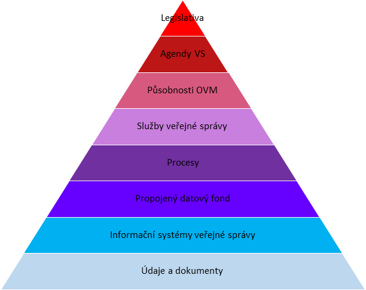

## Pyramida všeho důležitého

- [ ] DOPSAT úvodní kecy

- [ ] POPIS co je tohle za pyramidu

Pyramidu můžeme číst dvěma způsoby. Zdola, pokud chceme myslet jako realizátor konkrétní oblasti či služby a zhora, pokud jsme manažeři a potřebujeme, aby nám vše klaplo dohromady. Pokud na jakékoliv z těchto pater zapomeneme, máme problém.

- [ ] ROZMYSLET jestli víc rozebrat jednotlivá patra v textu
### 🖋 Co je důležité na jednotlivých patrech

#### 🖋 Patro Legislativa
#### 🖋 Patro Agendy VS
#### 🖋 Patro Působnosti OVM
#### 🖋 Patro Služby veřejné správy
#### 🖋 Patro Procesy
#### 🖋 Patro Propojený datový fond
#### 🖋 Patro Informační systémy veřejné správy
#### 🖋 Patro Údaje a dokumenty